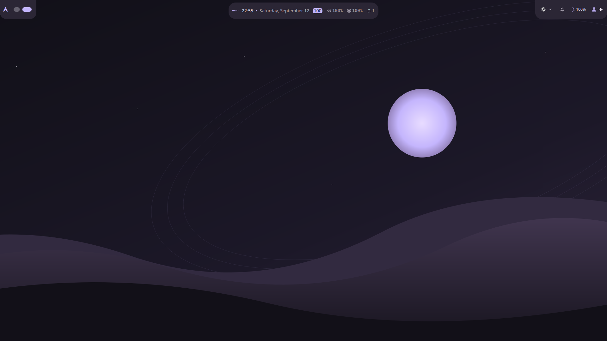

# Celeste for Niri

A Caelestia-inspired desktop profile for **Niri + DankMaterialShell**. Floating, animated Island panels, lavender accents on charcoal surfaces, pill workspaces, Noto Sans typography, and an original orbital landscape wallpaper. Includes matching light and dark palettes.



Celeste configures DMS; it does not fork it or install Caelestia. DMS supplies the launcher, notifications, media controls, control center, wallpaper picker, clipboard UI, and lock screen. Niri supplies scrolling workspaces and window management. Caelestia's exact UI and transitions are not reproduced.

## Requirements

- Linux with **Niri 26.04** and **DMS 1.6.1** (the versions verified for this release).
- Python 3.10+, Noto Sans, and CaskaydiaMono Nerd Font Mono.
- A working graphical Niri session for live use. Installation and installer tests do not need a running desktop.

Arch Linux is the supported setup path. Other distributions need to provide compatible DMS/Niri packages themselves. No AUR helper, Node, pip dependencies, or custom shell build is required.

## Quick setup — existing Niri + DMS

Download or clone this repository, then open its directory:

```sh
cd niri-celeste
./install.sh doctor
./install.sh plan
./install.sh apply
```

DMS watches its configuration and applies the profile live. If DMS was updated since login, reload the installed shell first with `systemctl --user reload dms.service`. This briefly recreates shell panels; your compositor and apps keep running. Never launch a second DMS instance beside the service.

The installer changes the appearance settings and replaces your bar layout with the Celeste layout on all displays. It preserves unrelated settings, existing Niri configuration, app shortcuts, display modes, plugins, session data, and wallpaper selection. Backups are created before changes. A repeat apply with the same effective settings changes nothing.

Select the included wallpaper from the DMS wallpaper picker, or use:

```sh
dms ipc call wallpaper set "${XDG_CONFIG_HOME:-$HOME/.config}/DankMaterialShell/themes/celeste/wallpaper.svg"
```

Wallpaper selection is optional and separate from installation/restore. Record your current path with `dms ipc call wallpaper get` before changing it.

## Starting from a fresh Arch installation

These commands assume a working Arch system with a display manager or a usable TTY. Review the package transaction as usual:

```sh
sudo pacman -Syu --needed niri dms-shell python noto-fonts ttf-cascadia-code-nerd foot xdg-desktop-portal-gtk
cd niri-celeste
./install.sh plan --with-niri
./install.sh apply --with-niri
systemctl --user enable dms.service
```

Choose **Niri** in your display manager, or run `niri-session` from a TTY. The starter uses Foot as its terminal and auto-detects displays. `--with-niri` refuses to overwrite an existing different Niri configuration. The installer never starts a compositor, enables services, changes authentication, or installs packages itself.

For existing Niri installations without DMS, install the packages above and use the regular apply command. Enable the DMS service and log into Niri again. Add the shell shortcuts from [the starter config](examples/niri/config.kdl) to your existing `binds` block as needed. Do not copy an entire second `binds` block with conflicting shortcuts.

DMS must be the only owner of the notification service and its shell surfaces. Before enabling it on an existing desktop, review any Waybar, Mako, SwayNC, standalone wallpaper, lock/idle, clipboard, and polkit helpers. [Integration notes](docs/integration.md) explain the boundaries; do not disable a working lock/idle setup just to apply a theme.

## Restore

```sh
./install.sh restore
```

Restore reverses the latest successful apply. It restores profile-owned settings while preserving unrelated settings added afterward. If you changed a profile-owned setting or installed asset afterward, restore stops and names the conflict rather than discarding that change. Exact original files remain in `${XDG_STATE_HOME:-$HOME/.local/state}/niri-celeste/backups/` for manual recovery. Do not delete that directory until you no longer need rollback.

Changing a wallpaper with IPC is not rolled back by this command; reselect your previous wallpaper before restoring, since restore removes the installed wallpaper if Celeste created it.

## Customize

- Edit `themes/celeste/theme.json` for both palettes.
- Edit `profile/settings.json` for typography, spacing, motion, and bar composition; then run plan/apply.
- The center Island uses a full weekday/month date, volume and brightness readouts, and a 48px compact thickness. DMS sizes its width to its content; disable those readouts in `islandHomeLayout` for a smaller pill.
- For a conventional full bar, set `barConfigs[0].island` to `false` in the profile. The same widget layout is supplied for that mode.
- For reduced motion, use DMS's accessibility settings, or add top-level `"reduceMotion": true` plus `"islandReducedMotion": true` inside the bar entry in your profile.
- Use DMS settings to select dark/light mode. Celeste preserves your current preference.

`@THEME@` is resolved by the installer to your XDG configuration directory. No username, output name, network credentials, app history, or personal wallpaper path is bundled. `profile/defaults.json` records the defaults needed to recognize DMS's sparse settings when restoring; update it when adding profile-owned keys that match DMS defaults.

System-wide application theme generation is disabled by this profile, so installing it does not ask DMS to recolor your editors, terminals, or browser profiles. DMS can still regenerate its own Niri layout file when geometry preferences change. See [architecture and ownership](docs/architecture.md).

## Development

```sh
python3 -m unittest discover -s tests -v
niri validate -c examples/niri/config.kdl
```

Try installation without touching your desktop:

```sh
./install.sh apply --config-home /tmp/celeste-demo/config --state-home /tmp/celeste-demo/state
./install.sh restore --config-home /tmp/celeste-demo/config --state-home /tmp/celeste-demo/state
```

Use the same configuration and state directories for apply and restore. Symlinked target paths are refused so an installer cannot silently replace a dotfile-manager link; manage the equivalent profile changes in your dotfiles instead.

See [verification](docs/verification.md) for desktop checks and known limits. CI runs isolated installer tests and validates the starter Niri configuration. It does not start a desktop or authenticate a lock screen.

## Credits and license

Visual inspiration: [Caelestia](https://github.com/caelestia-dots/shell). Runtime: [DankMaterialShell](https://github.com/AvengeMedia/DankMaterialShell), [Quickshell](https://quickshell.org/), and [Niri](https://github.com/niri-wm/niri). This is an independent configuration project, not an official port or affiliation. No Caelestia source or assets are bundled.

Celeste's original configuration, installer, documentation, and wallpaper are MIT licensed. Upstream software and fonts retain their own licenses.
